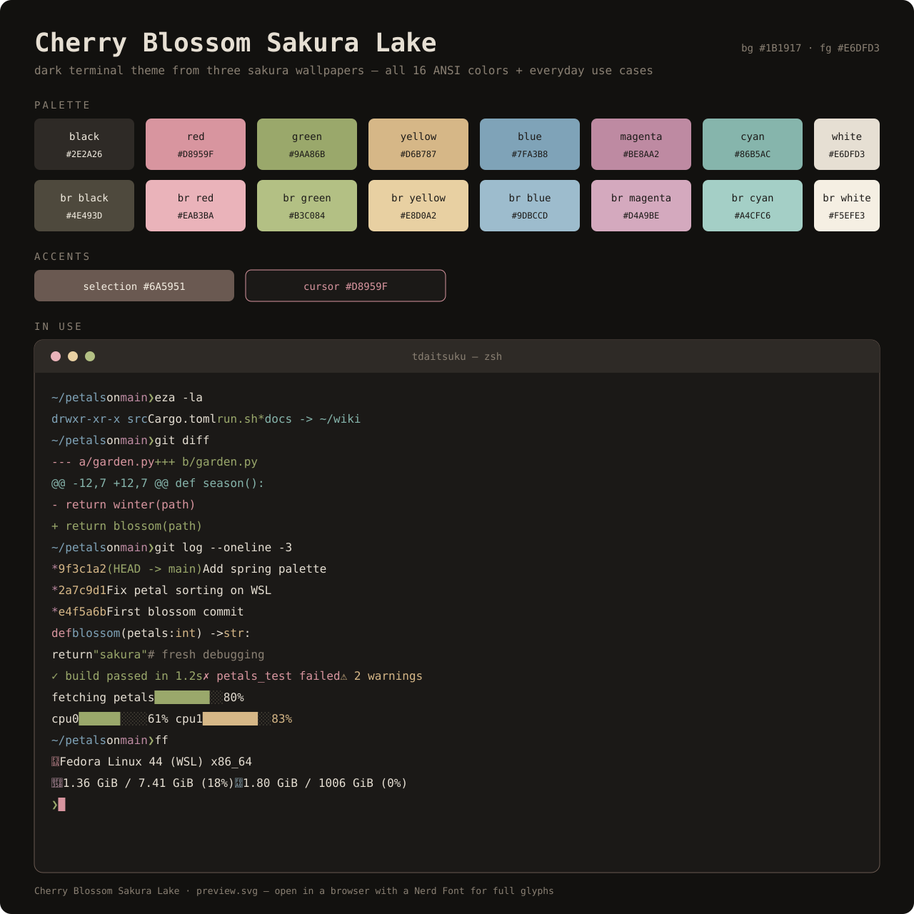

# Cherry Blossom Sakura Lake

A dark terminal theme sampled from three sakura wallpapers — lake + blossom canopy, blossom close-up, backlit blossoms. Warm charcoal base, petal-white foreground, moss/umber/rosewood accents measured straight from the photos.



## Palette

`scheme.json` is the source of truth — every file below is generated from it, so all ports match exactly.

| Role | Hex | From |
|---|---|---|
| background | `#1B1917` | Branch black `#393939`, deepened warm |
| foreground / white | `#E6DFD3` | Petal whites `#EDEAE5` `#EEEEEC` |
| black | `#2E2A26` | Dark umber `#2D2B15` `#433D22` |
| red (sakura) | `#D8959F` | Blush `#BCAEA1`, lifted for dark-bg legibility |
| green (moss) | `#9AA86B` | Moss `#4F4F33` `#514D2F`, brightened |
| yellow (blush gold) | `#D6B787` | Canopy tan `#AD9B8B` `#C2B6A9` |
| blue (lake) | `#7FA3B8` | Overcast lake water / sky gray |
| purple (dusk rose) | `#BE8AA2` | Mauve `#95837B`, lifted |
| cyan (shallow water) | `#86B5AC` | Lake gray-green `#76767C` |
| selection | `#6A5951` | Measured rosewood, used as-is |
| cursor | `#D8959F` | Sakura red |
| input / panel base | `#1F1D1A` | Boxes sit just above the bg, separated by the border |
| chat surface | `#1F1D1A` | Message boxes, same quiet base |
| bright black | `#4E493D` | Lifted umber |
| bright white | `#F5EFE3` | Brightest petal |

Bright variants (`brightRed`–`brightCyan`) are ~one step lighter than their normal counterparts.

## Source wallpapers

- `vanja-milicic-1f36Xtd7QhI-unsplash.jpg` — lake + blossom canopy, boats
- `phil-nguyen-HA2HqoGmkO0-unsplash.jpg` — blossom close-up
- `wallpaper.jpg` — backlit blossoms, dark branches

## Files

| File | For |
|---|---|
| `scheme.json` | Windows Terminal color scheme (canonical palette) |
| `kitty.conf` | Kitty |
| `alacritty.toml` | Alacritty (0.13+, TOML) |
| `CherryBlossomSakuraLake.colorscheme` | Konsole |
| `install-gnome-terminal.sh` | GNOME Terminal (via dconf, see below) |
| `opencode.json` | OpenCode TUI theme — copy to `~/.config/opencode/themes/sakura-lake.json`, set `theme.name` to `sakura-lake` in `cli.json` |
| `preview.svg` | Preview card — open in a browser (Nerd Font recommended) |

## Install

### Windows Terminal

1. Open Settings (`Ctrl+,`) → **Color schemes** → paste the object from `scheme.json` as a new scheme (or edit `settings.json` → `schemes` directly).
2. Set it as your scheme under **Profiles → Defaults → Appearance**.

### Kitty

Copy `kitty.conf` to `~/.config/kitty/kitty.conf`, or include it:

```
include ./kitty.conf
```

### Alacritty

Merge `alacritty.toml` into `~/.config/alacritty/alacritty.toml`.

### Konsole

Copy the `.colorscheme` file to `~/.local/share/konsole/`, then select it in *Settings → Edit Current Profile → Appearance*.

### GNOME Terminal

```bash
chmod +x install-gnome-terminal.sh
./install-gnome-terminal.sh
```

Then pick the profile under *Preferences → Profiles*. Re-running is safe. Transparency is set to ~15% for a soft acrylic feel.

### OpenCode

```bash
mkdir -p ~/.config/opencode/themes
cp opencode.json ~/.config/opencode/themes/sakura-lake.json
```

Then in `~/.config/opencode/cli.json`:

```json
{
  "theme": {
    "name": "sakura-lake",
    "mode": "dark"
  }
}
```

Takes effect on next TUI launch.

## Previews


